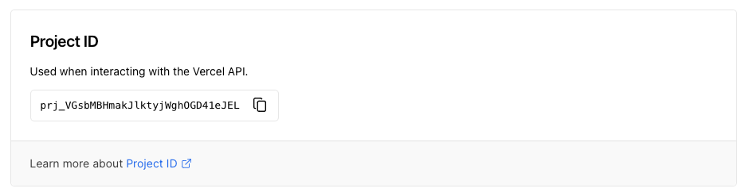

# Vercel Preview URL


[](https://github.com/PatrickHeneise/vercel-preview-action-test/actions/workflows/integration.yml)

[](https://github.com/semantic-release/semantic-release)
[](https://conventionalcommits.org)

Retrieve the preview URL from the Vercel API, filtered by the repo and branch. The URL can then be used for further end-to-end tests, link checks and other PR integrations/actions.

The main difference to [Capture Vercel Preview URL](https://github.com/marketplace/actions/capture-vercel-preview-url) is that the action runs on `push` and `pull_request`, not on `issue_comment`. This enables 3rd party GitHub integrations to report directly on the Pull Request.

## Table of Contents

- [Vercel Preview URL](#vercel-preview-url)
  - [Table of Contents](#table-of-contents)
  - [Usage](#usage)
  - [Environment Variables / Secret](#environment-variables--secret)
  - [Inputs](#inputs)
  - [Outputs](#outputs)
  - [Contributing](#contributing)
  - [License](#license)

## Usage

- [Create a Vercel API Token](https://vercel.com/account/tokens)
- See [Integration Test / Demo](https://github.com/PatrickHeneise/vercel-preview-action-test/blob/main/.github/workflows/integration.yml)

Vercel needs a little time to build the preview, you can check the average build time in your deployments and add the seconds plus a little to a `sleep` action, to wait until the deployment is `READY`.

Instead of an arbitrary time, the [Await for Vercel deployment](https://github.com/marketplace/actions/await-for-vercel-deployment) Action can be used.

```yaml
- run: sleep 30
- name: vercel-preview-url
  uses: zentered/vercel-preview-url@v1.1.9
  id: vercel_preview_url
  env:
    VERCEL_TOKEN: ${{ secrets.VERCEL_TOKEN }}
  with:
    vercel_project_id: 'prj_XYZ123'
- name: Get URL
  run: echo "https://${{ steps.vercel_preview_url.outputs.preview_url }}"
```

### Vercel Project ID

Your project name is not the same as the project ID. You can find the project ID in the Project Settings, it starts with `prj_`:



## Environment Variables / Secret

In the repository, go to "Settings", then "Secrets" and add "VERCEL_TOKEN", the value you can retrieve on your [Vercel account](https://vercel.com/account/tokens).

## Inputs

To see more information on inputs, see the [Vercel Documentation](https://vercel.com/docs/rest-api#endpoints/deployments/list-deployments).

| Name                | Requirement | Type      | Description                  |
| ------------------- | ----------- | --------- | ---------------------------- |
| `vercel_team_id`    | optional    | string    | Team id                      |
| `vercel_app`        | optional    | string    | Name of the deployment       |
| `vercel_from`       | optional    | timestamp | Deployment after this date   |
| `vercel_project_id` | optional    | string    | Vercel project id            |
| `vercel_since`      | optional    | timestamp | Deployment since this date   |
| `vercel_state`      | optional    | string    | Filter on state              |
| `vercel_target`     | optional    | string    | Deployment environment       |
| `vercel_to`         | optional    | timestamp | Deployment before this date  |
| `vercel_until`      | optional    | timestamp | Deployment before this date  |
| `vercel_users`      | optional    | string    | Filter on created by user(s) |

## Outputs

| Name               | Description                                                                                                             |
| ------------------ | ----------------------------------------------------------------------------------------------------------------------- |
| `preview_url`      | A string with the unique URL of the deployment. If it hasn't finished uploading (is incomplete), the value will be null |
| `deployment_state` | A string with the current deployment state, it could be one of the following QUEUED, BUILDING, READY, or ERROR.         |

## Contributing

See [CONTRIBUTING](CONTRIBUTING.md).

## License

See [LICENSE](LICENSE).
